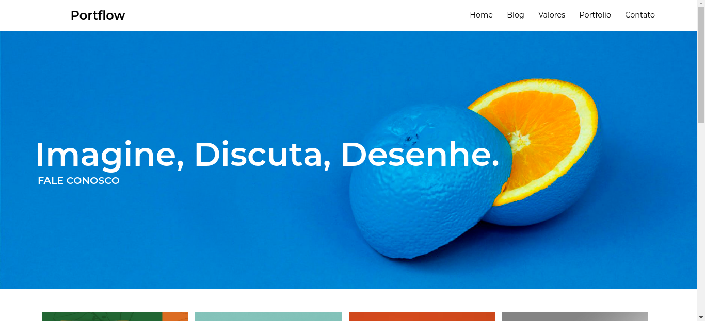
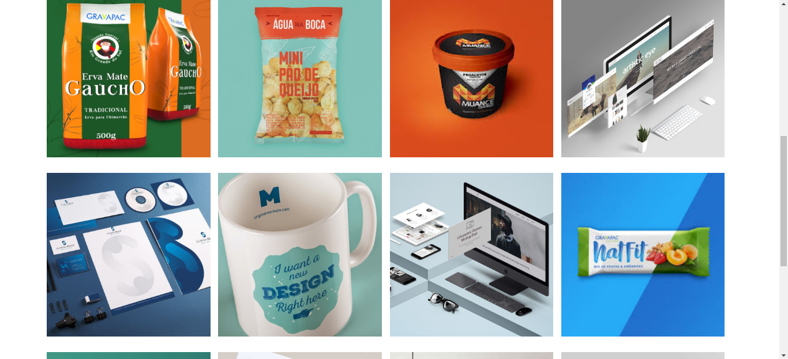
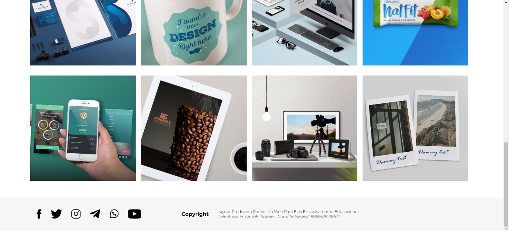

---

<h1 align="center">Portflow</h1>

O Portflow é um dos projetos finais do primeiro módulo do curso do VaiNaWeb. É uma página responsiva com imagens.

---

<h2 align="center">Design</h2>

---

<h2  align="center">Application demo</h2>

---

<h2  align="center">Project</h2>

 

---

<h2  align="center">Technologies</h2>

---

<h3 align="center">Funcionalidades</h3>

- [] Responsividade

---

<h3 align="center">Academia</h3>

<section>
    
</section>

---

<h3 align="center">Status</h3>

    🚧 Em desenvolvimento... 🚧

